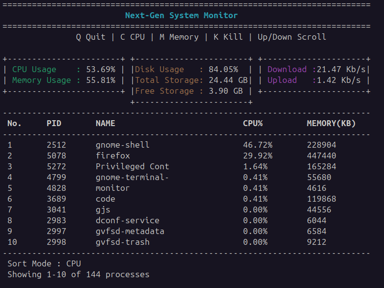

# 🚀 Next-Gen Linux System Monitor

A multithreaded Linux system monitoring tool built in modern C++ that provides real-time CPU, memory, disk, network, and process monitoring through an interactive ncurses-based dashboard. The application leverages Linux system interfaces such as `/proc` and `statvfs` to collect live system metrics while maintaining a responsive user interface using multithreading and thread-safe data sharing.

## 📖 Overview

Next-Gen Linux System Monitor is a real-time terminal-based system monitoring application developed in C++ for Linux environments. It is designed to provide users with live insights into system performance while demonstrating core systems programming concepts such as multithreading, process management, file system interaction, and thread synchronization.

The application gathers CPU, memory, disk, network, and process information directly from Linux system interfaces such as `/proc` and `statvfs`. A dedicated background thread continuously collects system statistics, while the main thread renders an interactive ncurses-based dashboard, ensuring a responsive user interface through mutex-protected shared data.

## 🌟 Project Highlights

- Built entirely in Modern C++ for Linux.
- Uses multithreading to separate data collection from UI rendering.
- Reads live system statistics directly from `/proc` and `statvfs`.
- Interactive ncurses dashboard with keyboard navigation.
- Modular architecture with dedicated rendering, monitoring, process, and system modules.

## ✨ Features

### 📊 System Monitoring
- Real-time CPU usage monitoring
- Real-time memory usage monitoring
- Disk usage, total storage, and free storage statistics
- Live network upload and download speed monitoring

### ⚙️ Process Management
- Displays all active Linux processes
- Sort processes by CPU usage
- Sort processes by memory usage
- Terminate processes directly from the dashboard
- Scroll through the complete process list using keyboard navigation

### 🖥️ Interactive Dashboard
- Built with **ncurses** for a terminal-based interface
- Color-coded sections for improved readability
- Displays the current sorting mode
- Shows the visible process range (e.g., *Showing 11–20 of 127 processes*)
- Responsive keyboard controls

### 🚀 Architecture & Performance
- Multithreaded design for responsive UI updates
- Dedicated background thread for data collection
- Thread-safe shared data using **std::mutex**
- Efficient data sharing through a centralized `SystemData` structure
- Modular project structure with separated rendering, monitoring, and system information modules.
  
  ## 📸 Dashboard Preview

The following screenshot shows the interactive terminal dashboard displaying real-time system statistics, process information, and network activity.



## 🏗️ Architecture

The application follows a modular architecture where each component is responsible for a specific task.

```
                 +-------------------+
                 |     main.cpp      |
                 +-------------------+
                           |
            Creates Collector Thread
                           |
                           v
              +-----------------------+
              |  collectSystemData()  |
              +-----------------------+
                           |
            Collects CPU, Memory, Disk,
           Network and Process Statistics
                           |
                           v
                 +------------------+
                 |    SystemData    |
                 +------------------+
                           ^
                           |
                  Protected by Mutex
                           |
                           v
              +-----------------------+
              |   renderDashboard()   |
              +-----------------------+
                           |
                           v
                 Interactive ncurses UI
```

### Modules

- **main.cpp** – Initializes ncurses, starts the collector thread, and controls the application loop.
- **monitor.cpp** – Handles keyboard input, process termination, ncurses initialization, and data collection.
- **system.cpp** – Collects CPU, memory, disk, and network statistics from Linux system interfaces.
- **process.cpp** – Retrieves process information and calculates per-process CPU and memory usage.
- **renderer.cpp** – Renders the interactive dashboard using ncurses.

## 📂 Project Structure

```
system-monitor/
├── build/                 # Build files generated by CMake
├── include/               # Header files
│   ├── monitor.h
│   ├── process.h
│   ├── renderer.h
│   └── system.h
├── screenshots/           # Project screenshots
│   └── dashboard.png
├── src/                   # Source files
│   ├── main.cpp
│   ├── monitor.cpp
│   ├── process.cpp
│   ├── renderer.cpp
│   └── system.cpp
├── CMakeLists.txt         # CMake build configuration
└── README.md              # Project documentation
```

## 🛠️ Technologies Used

- **Language:** C++
- **Operating System:** Linux (Ubuntu)
- **User Interface:** ncurses
- **Build System:** CMake
- **Concurrency:** C++ Threads (`std::thread`)
- **Synchronization:** `std::mutex`, `std::atomic`
- **Linux APIs:** `/proc`, `statvfs`, POSIX signals
- **Standard Library:** STL (vector, string, algorithm, filesystem-independent utilities)

## ⚙️ Build & Run

### Prerequisites

- Linux (Ubuntu recommended)
- C++17 compatible compiler
- CMake (>= 3.10)
- ncurses development library

Install ncurses (Ubuntu):

```bash
sudo apt update
sudo apt install libncurses5-dev libncursesw5-dev
```

### Build
Clone the repository and build the project using CMake:

```bash
git clone <https://github.com/saksham-2025/System-Monitor>
cd system-monitor

mkdir build
cd build

cmake ..
make
```

### Run

```bash
./monitor
```

## 🎮 Controls

| Key | Action |
|-----|--------|
| `C` | Sort processes by CPU usage |
| `M` | Sort processes by memory usage |
| `↑` | Scroll up through the process list |
| `↓` | Scroll down through the process list |
| `K` | Terminate a process by entering its PID |
| `Q` | Quit the application |

## 🚀 Future Improvements

- Automatically detect the active network interface instead of using a fixed interface name (`enp0s3`), allowing the application to work across different Linux systems without code changes.

## 📚 Learning Outcomes

Through this project, I gained hands-on experience with:

- Linux system programming using `/proc` and `statvfs`
- Multithreaded application design using `std::thread`
- Thread synchronization with `std::mutex` and `std::atomic`
- Process monitoring and CPU usage calculation
- Real-time terminal user interfaces using `ncurses`
- Modular software design and separation of responsibilities
- Efficient data sharing between concurrent threads
- Building and managing C++ projects with CMake